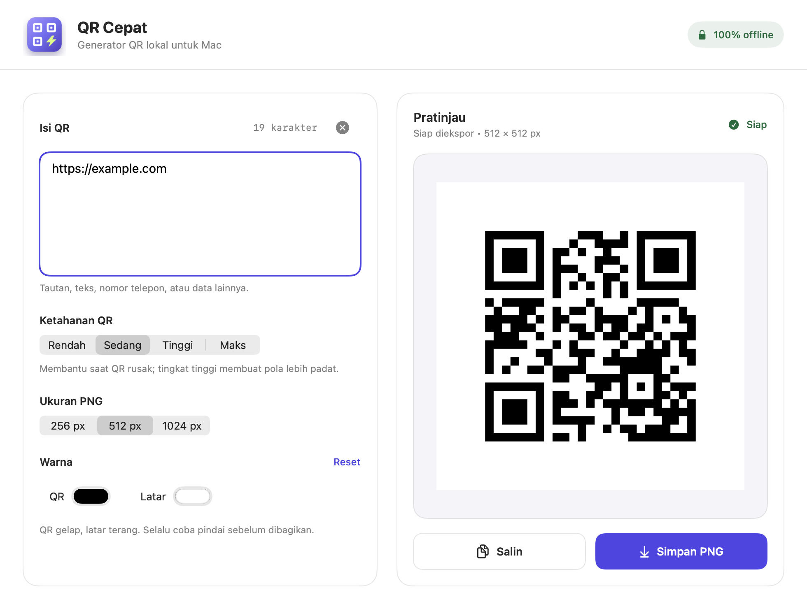

# QR Cepat

**Tempel. Buat QR. Salin. Utilitas QR offline untuk macOS.**

[English](README.md) · [Unduh beta](https://github.com/yottt-1/qr-cepat/releases) · [Ikut uji beta](docs/BETA.md) · [Lisensi MIT](LICENSE)



QR Cepat membuat QR dari teks dan tautan langsung di Mac. Tanpa akun, server,
pelacakan, langganan, atau layanan pengalihan tautan. Antarmuka berbahasa Indonesia.

## Instalasi

1. Unduh `QR-Cepat-v0.1.0-beta.1-macOS-arm64.zip` di halaman Releases.
2. Ekstrak ZIP, lalu pindahkan **QR Cepat.app** ke **Applications**.
3. Buka, ganti teks contoh, lalu pilih **Simpan PNG** atau **Salin**.

**Kebutuhan:** macOS 13+, Apple Silicon (M1 atau lebih baru). Unduhan beta ini
belum diuji pada Intel Mac. Belum ada dukungan Windows/Linux.

**Penting:** aplikasi beta ditandatangani secara ad-hoc dan **belum dinotarisasi
Apple**. macOS mungkin memblokirnya. Tanda tangan ini bukan Developer ID; checksum
juga bukan bukti bahwa aplikasi aman. Anda dapat meninjau source dan build sendiri.
Baca [panduan keamanan aplikasi dari Apple](https://support.apple.com/en-gb/102445).
Jangan menonaktifkan Gatekeeper secara global. Signing Developer ID dan notarisasi
masih menjadi pekerjaan sebelum rilis stabil.

Verifikasi integritas unduhan dengan `SHA256SUMS` dari rilis yang sama:

```bash
shasum -a 256 -c SHA256SUMS
```

## Fitur

- Pratinjau langsung; ekspor nonaktif ketika isi sedang berubah.
- PNG tepat 256, 512, atau 1024 px.
- Empat tingkat koreksi error dan pilihan warna QR/latar.
- Modul QR diskalakan dalam piksel utuh dengan margin minimal empat modul.
- Penolakan warna berkontras rendah, QR terbalik, dan ukuran terlalu padat.
- Salin PNG/TIFF ke clipboard (**⌘⇧C**) atau simpan PNG (**⌘S**).
- Tampilan native light/dark dan dukungan reduced motion.
- Tanpa dependensi pihak ketiga saat aplikasi berjalan.

## Keandalan dan privasi

Isi teks dikodekan apa adanya, termasuk spasi. Tidak ada pengalihan tautan atau
masa aktif berlangganan; alamat tujuan tetap dapat berhenti berfungsi sendiri.
Aplikasi tidak mengunggah atau menyimpan input. File yang Anda ekspor dan gambar
yang disalin tetap dapat disimpan/disinkronkan oleh fitur sistem, misalnya
clipboard manager atau Universal Clipboard.

Ambang kontras 4,5:1 adalah aturan kehati-hatian aplikasi, **bukan jaminan bisa
dipindai**. Isi panjang mungkin membutuhkan ukuran 512/1024 px. Selalu uji QR
dengan pemindai serta ukuran cetak/tampilan yang akan digunakan. Kamera ponsel,
cetakan fisik, VoiceOver, dan versi macOS lama masih perlu pengujian pengguna beta.

## Build sendiri

Perlu toolchain Swift 6 dan macOS SDK (Xcode atau Command Line Tools yang sesuai).

```bash
git clone https://github.com/yottt-1/qr-cepat.git
cd qr-cepat
./test.sh
./build_app.sh
open "dist/QR Cepat.app"
```

`swift run QRCepat` untuk pengembangan. `./release.sh v0.1.0-beta.1` membuat ZIP
sesuai arsitektur mesin dan menampilkan SHA-256. Tes memakai executable Swift
mandiri dan decoder Vision; tidak memerlukan XCTest. Lihat
[catatan verifikasi](docs/VERIFICATION.md) untuk batas pengujiannya.

## Bantu uji beta

Target awal adalah **10–20 relawan pengguna Mac**, bukan jumlah pengguna yang
sudah bergabung. Ikuti [panduan lima menit](docs/BETA.md), lalu kirim
[feedback](https://github.com/yottt-1/qr-cepat/issues/new?template=beta-feedback.yml).
Issue bersifat publik: jangan sertakan password, token, tautan pribadi, atau
gambar QR yang memuat data sensitif.

[Kontribusi](CONTRIBUTING.md) · [Roadmap](docs/ROADMAP.md) · [Changelog](CHANGELOG.md)

Kode dan artwork asli berlisensi [MIT](LICENSE). Logo aplikasi bersifat dekoratif,
bukan QR yang dapat dipindai.
