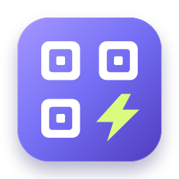
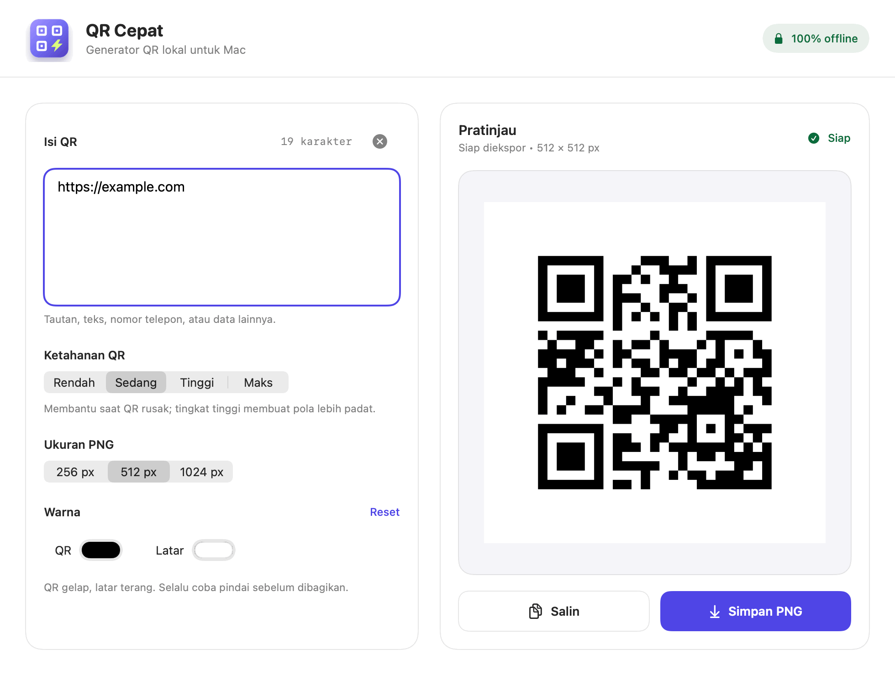

<p align="center"></p>

# QR Cepat

**Paste. Generate. Copy. An offline QR utility for macOS and Windows.**

[Bahasa Indonesia](README.id.md) · [Download beta](https://github.com/yottt-1/qr-cepat/releases) · [Join the beta](docs/BETA.md) · [MIT license](LICENSE)

QR Cepat turns text and links into QR images, entirely on your computer. No account,
server, tracking, subscription, or redirect service. The interface is currently
in Indonesian; the guide below covers the controls in English.



The walkthrough is rendered from the actual app views with sample data, not a
screen recording. [Light screenshot](docs/screenshot-light.png) · [Dark screenshot](docs/screenshot-dark.png)

## Download and install

### Windows — 0.2.0-beta.1

The Windows edition is a native WPF application with the same core workflow:
live preview, four correction levels, colors, exact PNG sizes, copy, and save.
Download the portable ZIP from the Windows CI artifact or Windows beta release,
extract **all files**, then open **QR Cepat.exe**. The .NET runtime is bundled;
no separate runtime installation or administrator access is required.

Target: Windows 10 22H2 / Windows 11 on Intel/AMD x64. Windows ARM64 and Linux
are not supported downloads in this beta. The beta is not Authenticode-signed;
SmartScreen may display an unknown-publisher warning. See the
[Windows guide](docs/WINDOWS.md) for download, verification, and test scope.

### macOS — 0.1.0-beta.1

1. Get `QR-Cepat-v0.1.0-beta.1-macOS-arm64.zip` from [Releases](https://github.com/yottt-1/qr-cepat/releases).
2. Unzip and drag **QR Cepat.app** to **Applications**.
3. Open the app, replace the example text, and choose **Simpan PNG** (Save PNG)
   or **Salin** (Copy).

**Requirements:** macOS 13 or later, Apple Silicon (M1 or newer). This beta's
download has not been tested on Intel Macs. The separate Windows edition is described above.

**Beta signing notice:** the download is ad-hoc signed, **not Apple-notarized**.
macOS may block it. This is not the same as a Developer ID release, and a checksum
does not prove the software is safe. Review the source/build locally if you prefer.
See [Apple's guidance on opening apps safely](https://support.apple.com/en-gb/102445).
Do not disable Gatekeeper globally. Developer ID signing/notarization is a
pre-stable-release task, not a completed feature.

To check the download against the release's `SHA256SUMS`, put both files in the
same directory and run:

```bash
shasum -a 256 -c SHA256SUMS
```

## Features

- Live QR preview with debounced input; stale previews cannot be exported.
- Exact 256 × 256, 512 × 512, and 1024 × 1024 PNG output.
- Four error-correction levels and customizable QR/background colors.
- Integer-scaled modules and at least four clear modules of margin on every side.
- Dark-on-light contrast checks and a minimum module size guard.
- Copy PNG/TIFF on Mac or PNG/bitmap on Windows; save PNG through a native dialog.
- Native light/dark appearance, keyboard shortcuts, and reduced-motion support.
- Native SwiftUI/Core Image on Mac; native WPF/QRCoder on Windows. Both process locally.

| Control | Meaning / shortcut |
| --- | --- |
| Isi QR | Text or link to encode, preserved exactly |
| Ketahanan QR | Error correction: Low / Medium / Quartile / High |
| Ukuran PNG | Export dimensions |
| QR / Latar / Reset | Foreground / background / restore black and white |
| Salin | Copy image — **⌘⇧C** |
| Simpan PNG | Save image — **⌘S** |

Windows uses **Ctrl+Shift+C** and **Ctrl+S**. Colors are editable hex values
(`#RRGGBB`) with a reset button. The Mac controls shown above use native color pickers.

## Reliability and privacy

Generated QR codes encode the exact text; there is no hosted redirect or
subscription expiry. A destination URL can still stop working independently.
The app does not upload or persist your input. Explicitly saved files and copied
images are outside the app: clipboard managers or Universal Clipboard may retain
or sync them. This app does not control those system features.

The 4.5:1 color check is a conservative application rule, **not a guarantee of
scanability**. Dense content may require 512 or 1024 px. Test every QR with its
intended scanner and print/display size before sharing. Phone cameras, physical
printing, VoiceOver, and older macOS versions still need beta-user verification.

## Build and test

Windows: install the .NET 10 SDK, then follow [the Windows build guide](docs/WINDOWS.md).
The Windows core and decoder tests can also run on macOS/Linux with .NET 10.

### macOS

Requires a Swift 6 toolchain and the macOS SDK (Xcode or compatible Command Line Tools).

```bash
git clone https://github.com/yottt-1/qr-cepat.git
cd qr-cepat
./test.sh
./build_app.sh
open "dist/QR Cepat.app"
```

For development, use `swift run QRCepat`. To package a release for the host's
architecture, run `./release.sh v0.1.0-beta.1`. The script prints a SHA-256 digest;
release assets include a matching `SHA256SUMS` file.

Tests use a standalone Swift executable, so XCTest/Swift Testing is not required.
They decode PNGs using Apple's Vision framework across all sizes and correction
levels, verify Unicode and whitespace, check color/density rejection, exercise an
isolated clipboard and file export, and verify preview state changes. See
[verification notes](docs/VERIFICATION.md) for the tested environment and limitations.

## Beta, contribution, and roadmap

We are looking for **10–20 volunteer Mac and Windows users**. Recruitment is a target, not a
claim of existing adoption. Try the [five-minute test](docs/BETA.md) and send
[beta feedback](https://github.com/yottt-1/qr-cepat/issues/new?template=beta-feedback.yml).
Never include passwords, tokens, private URLs, or sensitive QR images in public issues.

[Contributing](CONTRIBUTING.md) · [Roadmap](docs/ROADMAP.md) · [Changelog](CHANGELOG.md)

## License and credits

[MIT](LICENSE). Original app artwork is generated from the shared vector source
in `Sources/QRCepat/QRBrandArt.swift`. The logo is decorative, not a scannable QR.
System interface symbols are provided by macOS. Windows reuses the same app logo;
its bundled dependency notices are in [Windows/THIRD-PARTY-NOTICES.txt](Windows/THIRD-PARTY-NOTICES.txt).
